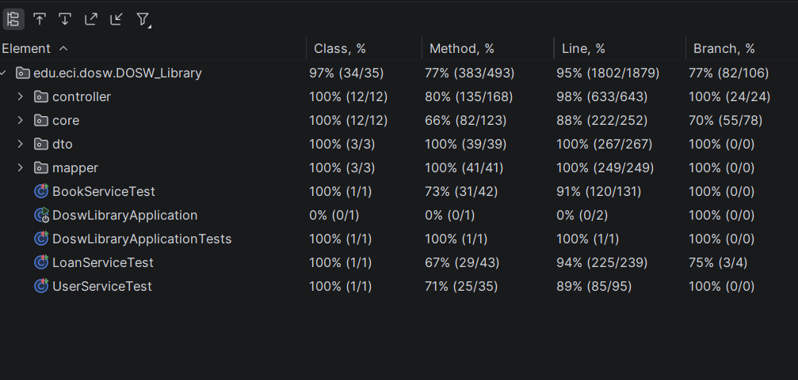
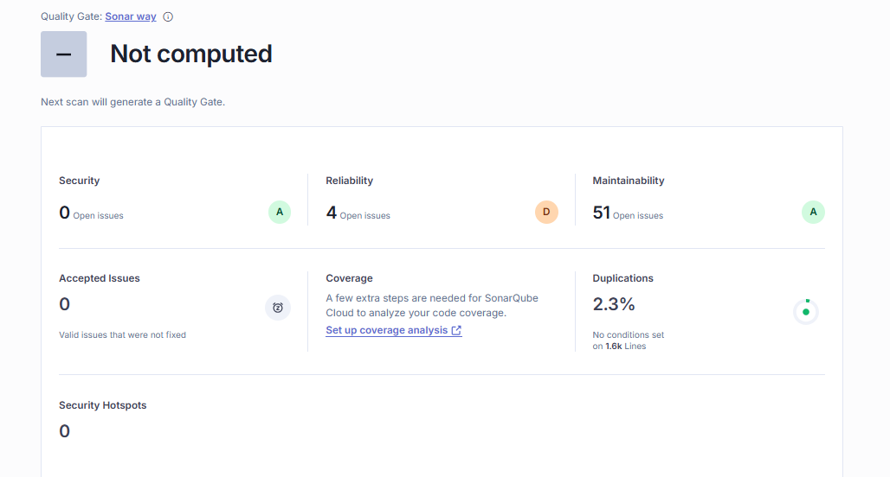

# DOSW-Library

El Core y la plataforma son los sistemas a crear, creando una base de datos como sistema externo, el usuario acude a la plataforma y la logica interna está envuelta en el core

Demo funcional:

https://mega.nz/file/0oNFWCSA#VEMy5JVR1bcN_2m-kSu2pD3V1ccSEOyXD0stjvJc5lY

Cobertura:

SonarQube:
